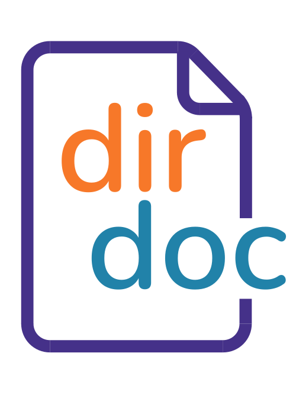

# dirdoc



dirdoc (directory documentor) is a command-line tool designed to quickly and easily package an entire codebase into a single (or multiple) Markdown file. This packaged document includes a comprehensive directory structure, file contents with syntax highlighting, and token/size statistics. It is especially useful for providing entire codebases to LLMs for analysis, bug fixing, or feature enhancements.

## Features

- **Comprehensive Documentation:**  
  Automatically scans a directory and generates a Markdown document that details the directory layout and includes file contents.

- **Syntax Highlighting:**  
  Supports language detection based on file extensions for enhanced readability in Markdown fenced code blocks.

- **Token and Size Statistics:**  
  Estimates and displays token counts and file size metrics to give insight into the generated document.

- **.gitignore Integration:**  
  Honors .gitignore files, allowing you to exclude specific files or directories from the documentation.

- **Output Splitting:**  
  Offers the option to split the output into multiple files if the generated document exceeds a specified size. This is particularly useful for meeting size limitations when sending the document to an LLM.

- **Flexible Modes:**  
  Provides options to generate structure-only documentation (skipping file contents) or to include everything.

## Universal Binary

Dirdoc builds a universal binary that can be executed on any system: macOS, Linux, or Windows. However, some additional steps may be required on your system to allow the file to run:

- **On macOS, Linux, or BSD:**  
  You may need to grant permission for your computer to execute the binary. (This is a one-time setup.)
  
  ```bash
  chmod +x dirdoc
  ```

- **On Windows:**  
  Rename the file by adding `.exe` at the end. For example:
  
  ```
  dirdoc -> dirdoc.exe
  ```

Once the appropriate permissions or renaming have been applied, you can run the binary as follows:

```bash
dirdoc --help
```

## Installation

1. **Clone the Repository:**

   ```bash
   git clone https://github.com/yourusername/dirdoc.git
   cd dirdoc
   ```

2. **Build the Application:**

   The project uses a Makefile for building. Run the following command to build the executable:

   ```bash
   make all
   ```

   This command will also download the required Cosmopolitan Libc dependency if it is not already present.

3. **Run Dirdoc from Anywhere**

   To run `dirdoc` from any folder on your system, you have a few options:

   ### On Linux and macOS

   - **Option 1:** Copy the binary to a directory in your system's PATH (e.g., `/usr/local/bin`):

     ```bash
     sudo cp build/dirdoc /usr/local/bin/dirdoc
     ```

     Ensure `/usr/local/bin` is in your PATH. You can now run `dirdoc` from any directory:

     ```bash
     dirdoc --help
     ```

   - **Option 2:** Add the `build` directory to your PATH. For example, if you use bash, add the following line to your `~/.bashrc` or `~/.bash_profile`:

     ```bash
     export PATH="$PATH:$(pwd)/build"
     ```

     Then, reload your profile:

     ```bash
     source ~/.bashrc  # or source ~/.bash_profile
     ```

   ### On Windows

   - **Option 1:** Copy the `dirdoc.exe` (found in the `build` folder after building) to a folder that is already in your PATH, such as `C:\Windows\System32` (you might need administrative privileges).

   - **Option 2:** Add the `build` folder to your PATH environment variable:

     1. Open **System Properties** (right-click on **This PC** > **Properties** > **Advanced system settings**).
     2. Click on **Environment Variables**.
     3. In the **System variables** section, find the **Path** variable, select it, and click **Edit**.
     4. Click **New** and add the full path to your `build` directory.
     5. Click **OK** to close all dialogs.

   Now, you can run `dirdoc` from any Command Prompt or PowerShell window:

   ```powershell
   dirdoc --help
   ```

## Releases

For convenience, pre-built binaries are available in the [GitHub Releases](https://github.com/ChrisNourse/dirdoc/releases) section. Simply download the appropriate file for your operating system, and you can run `dirdoc` without building it yourself.

## Usage

After setting up, you can run the application from anywhere on your system:

```bash
dirdoc --help
```

### Example Commands

- **Generate full documentation:**

  ```bash
  dirdoc /path/to/codebase
  ```

- **Specify a custom output file:**

  ```bash
  dirdoc -o custom_documentation.md /path/to/codebase
  ```

- **Ignore .gitignore rules:**

  ```bash
  dirdoc --no-gitignore /path/to/codebase
  ```

- **Generate structure-only documentation:**

  ```bash
  dirdoc --structure-only /path/to/codebase
  ```

- **Enable split output with a custom size limit:**

  ```bash
  dirdoc --split --limit 10 /path/to/codebase
  ```

- **Include .git folders in the documentation:**

  ```bash
  dirdoc --include-git /path/to/codebase
  ```

## Use Cases

Dirdoc is ideal for scenarios where you need to:

- Package an entire codebase into a single document for LLM analysis.
- Share a complete, self-contained reference of your codebase with team members or collaborators.
- Quickly debug or review a project by having both the structure and contents available in one file.
- Generate documentation that can be easily inspected, shared, or version-controlled.

## Contributing

Contributions are welcome! Please feel free to open issues or submit pull requests if you have suggestions or improvements.

## License

This project is licensed under the MIT License. See the LICENSE file for details.

## Acknowledgements

- Built with [Cosmopolitan Libc](https://github.com/jart/cosmopolitan).  
- For more information on Cosmo projects, visit:
  - [Cosmopolitan Documentation](https://github.com/jart/cosmopolitan/blob/master/docs/README.md)
- The code is human guided written by AI. Thanks Claude and chatGPT!
- The logo is human generated. Thanks Whit!
---
